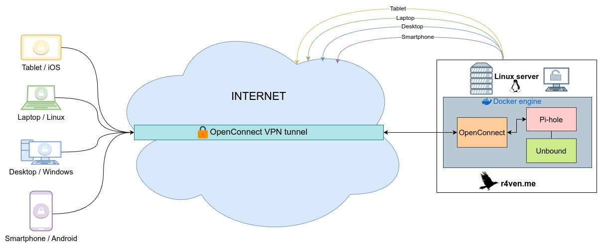

***This repo is a part of the complete instruction on [r4ven.me](https://r4ven.me/it-razdel/instrukcii/podnimaem-svoj-dns-server-unbound-i-blokirovshhik-reklamy-pihole-v-docker/) for deploying the Pi-hole + Unbound DNS server via docker and docker-compose. It comes better with [OpenConnect VPN server](https://github.com/r4ven-me/openconnect).***



When using a domain to obtain SSL certificates, uncomment the certbot service and the depends_on parameter for the openconnect service, and specify your values instead of example in the docker-compose.yml file.

## Installation and configuration of the OpenConnect VPN server

1. Preparation
```sh
sudo -s

mkdir -p /opt/pihole/{pihole_data,unbound_data} && cd /opt/pihole

touch ./unbound_data/{a,srv,forward}-records.conf
```

2. Creating an external docker network
```sh
docker network create \
    --opt com.docker.network.bridge.name=br_vpn \
    --driver bridge --subnet 10.10.11.0/24 vpn_network

docker network ls
```

3. Copying docker-compose.yml
```sh
curl -O https://raw.githubusercontent.com/r4ven-me/pihole/main/docker-compose.yml
```

4. Creating and running a containers Pi-hole + Unbound
```sh
docker-compose up -d && docker-compose logs -f
```

5. Autorun with systemd
```sh
docker compose down

curl -fLo /etc/systemd/system/pihole.service https://raw.githubusercontent.com/r4ven-me/pihole/main/pihole.service

systemctl daemon-reload

systemctl enable --now pihole
```